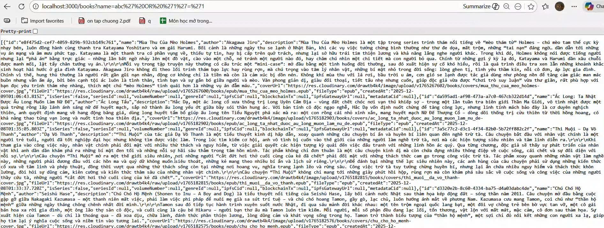

<p align="center">
  <a href="http://nestjs.com/" target="blank"></a>
</p>

[circleci-image]: https://img.shields.io/circleci/build/github/nestjs/nest/master?token=abc123def456
[circleci-url]: https://circleci.com/gh/nestjs/nest

  <p align="center">A progressive <a href="http://nodejs.org" target="_blank">Node.js</a> framework for building efficient and scalable server-side applications.</p>
    <p align="center">
<a href="https://www.npmjs.com/~nestjscore" target="_blank"></a>
<a href="https://www.npmjs.com/~nestjscore" target="_blank"></a>
<a href="https://www.npmjs.com/~nestjscore" target="_blank"></a>
<a href="https://circleci.com/gh/nestjs/nest" target="_blank"></a>
<a href="https://discord.gg/G7Qnnhy" target="_blank"></a>
<a href="https://opencollective.com/nest#backer" target="_blank"></a>
<a href="https://opencollective.com/nest#sponsor" target="_blank"></a>
  <a href="https://paypal.me/kamilmysliwiec" target="_blank"></a>
    <a href="https://opencollective.com/nest#sponsor"  target="_blank"></a>
  <a href="https://twitter.com/nestframework" target="_blank"></a>
</p>
  <!--[](https://opencollective.com/nest#backer)
  [](https://opencollective.com/nest#sponsor)-->

## Description

# 🛡️ Báo Cáo Thực Nghiệm Bảo Mật & Hiệu Năng
**Dự án:** Bookshelf API  
**Công nghệ:** NestJS, PostgreSQL, TypeORM, Cloudflare

## 👥 Thành Viên Thực Hiện
| STT | Họ và Tên | MSSV | Vai trò | Công việc phụ trách |
|:---:|:---|:---:|:---:|:---|
| 1 | **Hoàng Minh Chiến** | 22810310141 | Trưởng nhóm | Chống XSS, DDoS (Cloudflare setup), Tổng hợp báo cáo |
| 2 | **Tạ Kiều Vân** | 22810310335 | Thành viên | Chống SQL Injection, CORS, Rate Limiting |

## 📖 Giới thiệu
Tài liệu này ghi lại các biện pháp bảo mật đã được triển khai, quy trình kiểm thử (Penetration Testing) và kết quả thực tế để bảo vệ hệ thống khỏi các cuộc tấn công phổ biến.

## 📑 Mục lục
1. [Hướng dẫn Cài đặt & Chạy dự án](#-hướng-dẫn-cài-đặt--chạy-dự-án)
2. [Chống tấn công từ chối dịch vụ (DDoS)](#1-chống-tấn-công-từ-chối-dịch-vụ-ddos-protection)
3. [Thực nghiệm SQL Injection](#2-thực-nghiệm-sql-injection)
4. [Các biện pháp bảo mật khác (XSS, CORS...)](#3-các-biện-pháp-bảo-mật-khác)

---

## 🚀 Hướng dẫn Cài đặt & Chạy dự án

### Yêu cầu tiên quyết
* Node.js (v18 trở lên)
* PostgreSQL (đã cài đặt và tạo database)

### Cài đặt
```bash
# 1. Clone dự án
git clone <link-git-cua-ban>
cd <ten-thu-muc>

# 2. Cài đặt thư viện
npm install

# 3. Cấu hình môi trường (.env)
# Tạo file .env và điền thông tin DB của bạn
cp .env.example .env
1. Chống tấn công từ chối dịch vụ (DDoS Protection)
🔒 Giải pháp: Cloudflare WAF
Hệ thống sử dụng Cloudflare làm lớp lá chắn đầu tiên để lọc lưu lượng truy cập trước khi đến Server gốc (Render).

Rule Name: Challenge Non-VN (Block Foreign IP).
Cơ chế: Chặn hoặc yêu cầu xác thực (Managed Challenge) đối với tất cả IP không đến từ Việt Nam.
Mục đích: Ngăn chặn Botnet quốc tế và giảm tải cho Server.
💥 Công cụ kiểm thử: Loader.io
Giả lập tấn công (Stress Test) từ các Server tại Mỹ.
Mode: Clients per second (Mô phỏng DDoS).
Load: 50 - 250 request/giây.
Target: https://api.zenly.id.vn.

📊 Kết quả Demo
Khi bật WAF Rule, hệ thống chặn thành công phần lớn lưu lượng tấn công.
Tỷ lệ lỗi (Error Rate): ~71% (Request bị chặn bởi Cloudflare).
Mã phản hồi: Chủ yếu là 403 Forbidden thay vì sập server.


2. Thực nghiệm SQL Injection
Đã thực hiện dựng lại hiện trường lỗ hổng SQL Injection để hiểu rõ cơ chế tấn công và cách phòng chống.

🧪 Kịch bản kiểm thử
Mục tiêu là tấn công vào API tìm kiếm sách để lấy toàn bộ dữ liệu database thay vì một quyển sách cụ thể.

Endpoint: GET /books

Param: name (hoặc title)

❌ Code Lỗ hổng (Vulnerable Code)
Sử dụng nối chuỗi trực tiếp (String Concatenation) tạo điều kiện cho hacker chèn mã độc.

// books.service.ts
async findAll(name: string) {
  // Lỗi bảo mật nghiêm trọng: Cộng chuỗi trực tiếp
  const sql = `
    SELECT * FROM books
    WHERE books.name = '${name}' 
    ORDER BY books."createdAt" DESC
  `;
  return this.bookRepository.query(sql);
}
💣 Phương thức tấn công (Payload)
Hacker sử dụng kỹ thuật "Always True" (Luôn đúng) để vô hiệu hóa bộ lọc.

URL Tấn công:

/books?name=abc' OR '1'='1
Câu lệnh SQL thực tế chạy trong Database:

SQL

SELECT * FROM books WHERE books.name = 'abc' OR '1'='1' ...
Kết quả: API trả về TOÀN BỘ DANH SÁCH SÁCH thay vì rỗng.


✅ Code An toàn (Secure Code)
Sử dụng cơ chế Parameter Binding của TypeORM hoặc thư viện Database Driver để tự động xử lý ký tự đặc biệt.

// books.service.ts (Fixed)
async findAll(name: string) {
  // Sử dụng TypeORM Query Builder hoặc Find Options
  return this.bookRepository.find({
    where: { name: name } // An toàn tuyệt đối
  });
}
Kết quả sau khi fix: Nếu nhập Payload tấn công, hệ thống sẽ tìm quyển sách có tên đúng y hệt như payload => Trả về rỗng (An toàn) vì cơ chế ban đầu là lấy full danh sách được luôn nên khi test có thay đổi 1 chút sẽ ko lấy được tất cả -> trả về rỗng là kết quả đúng còn hiển thị full sách sẽ là kết quả sai. về sau khi đã fix được thì sẽ lấy được full danh sách nhưng ko thể injection được nữa có test bằng cách thêm 'OR 1 = 1' vẫn sẽ trả về full sách là đúng.

3. Các biện pháp bảo mật khác
Hệ thống đang tiếp tục được nâng cấp với các tiêu chuẩn bảo mật sau:
XSS (Cross-Site Scripting)
Vấn đề: Người dùng cố ý nhập các thẻ script độc hại (ví dụ: <script>alert('hacked')</script>).
Giải pháp: Sử dụng Global Interceptor kết hợp thư viện xss.
Cơ chế:
Mặc dù Frontend đã có cơ chế chặn hiển thị, nhưng Backend vẫn cần lọc để đảm bảo tính toàn vẹn dữ liệu (Defense in Depth).
Hệ thống quét toàn bộ Body, Query, Params.
Tự động mã hóa (escape) các ký tự nguy hiểm thành ký tự an toàn trước khi lưu vào Database.
Ví dụ: <script> sẽ được lưu thành &lt;script&gt;.
Các lớp bảo mật bổ sung
SSL/TLS (HTTPS): Đã kích hoạt qua Cloudflare (Hiển thị ổ khóa an toàn, chống nghe lén Man-in-the-Middle).
CORS: Cấu hình chặt chẽ, Whitelist chỉ cho phép domain Frontend (zenly.id.vn) được gọi API.
Rate Limiting: Giới hạn số lượng request/phút từ 1 IP để chống spam/brute-force.
Authentication & Authorization:
Sử dụng JWT (Access Token & Refresh Token).
Xác thực Email (Verify Email).
Phân quyền người dùng (Roles Guard).
Validation dữ liệu đầu vào (DTO).

[Link web]: (https://zenly.id.vn)
[Link BE]: (https://api.zenly.id.vn)